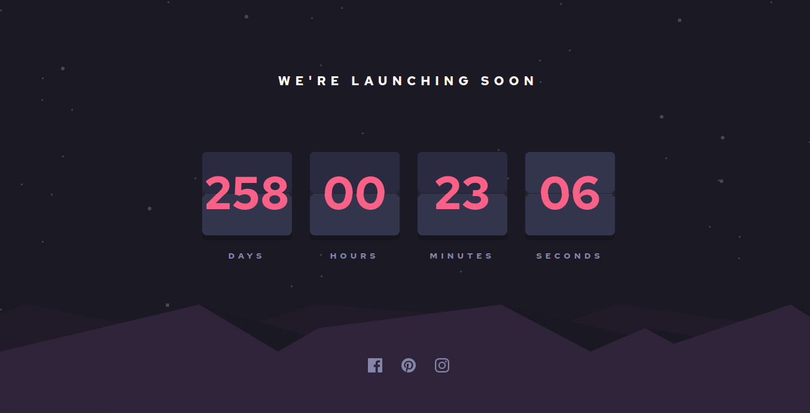

# Frontend Mentor - Launch countdown timer solution

This is a solution to the [Launch countdown timer challenge on Frontend Mentor](https://www.frontendmentor.io/challenges/launch-countdown-timer-N0XkGfyz-). Frontend Mentor challenges help you improve your coding skills by building realistic projects.

## Table of contents

-   [Overview](#overview)
    -   [The challenge](#the-challenge)
    -   [Screenshot](#screenshot)
    -   [Links](#links)
-   [My process](#my-process)
    -   [Built with](#built-with)
    -   [What I learned](#what-i-learned)
    -   [Continued development](#continued-development)
    -   [Useful resources](#useful-resources)
-   [Author](#author)
-   [Acknowledgments](#acknowledgments)

## Overview

### The challenge

Users should be able to:

-   See hover states for all interactive elements on the page
-   See a live countdown timer that ticks down every second (start the count at 14 days)
-   **Bonus**: When a number changes, make the card flip from the middle

### Screenshot

### Links

-   Solution URL: [https://www.frontendmentor.io/solutions/my-first-sass-project-a-flip-countdown-clock-lGGQKBpRt](https://www.frontendmentor.io/solutions/my-first-sass-project-a-flip-countdown-clock-lGGQKBpRt)
-   Live Site URL: [https://ameyadeokule.github.io/countdown-clock/](https://ameyadeokule.github.io/countdown-clock/)

## My process

### Built with

-   Semantic HTML5 markup
-   CSS custom properties
-   Flexbox
-   Mobile-first workflow
-   SASS
-   [GASP](https://greensock.com/gsap/) - JS Animation Library

### What I learned

### Continued development

Try doing the animation without using the GASP library. Conveting the project to Svelte.

### Useful resources

-   [The Beginner’s Guide to the GreenSock Animation Platform](https://www.freecodecamp.org/news/the-beginners-guide-to-the-greensock-animation-platform-7dc9fd9eb826/) - This helped me for understand the types of animation avalable. I learned the basics of timeline animation and how to use it.

-   [GSAP Animation Tutorial | Create Awesome Animations With Javascript by Dev Ed](https://www.youtube.com/watch?v=5RyrIPCs47A) - This tutorial taught me how to use the library and integrate it into the workflow. Also I made smaller animation shown in the tutorial to prepare me to complete this flip clock challenge.

## Author

-   Name - [Ameya Deokule]
-   Frontend Mentor - [@ameyadeokule](https://www.frontendmentor.io/profile/ameyadeokule)

## Acknowledgments

I would like thank Kethmar Salumets [@developerhabits](https://twitter.com/developerHabits) for encouraging me to start completing challenges on Frontend Mentor.
